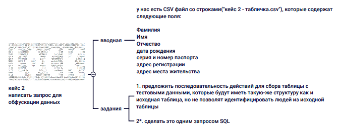
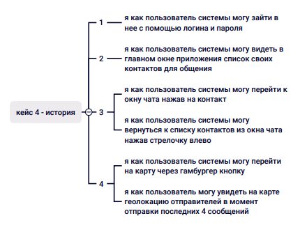
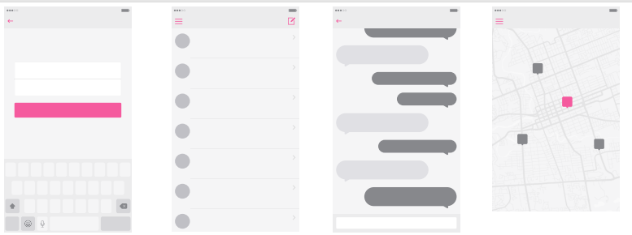
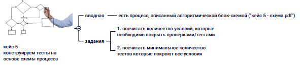
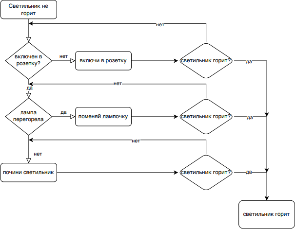

# Тестовое задание

## Кейс 1. Тестирование лежачего полицейского

Модульные тесты:

- проверить, соответствуют ли знаки ПДД
- проверить, расположены ли знаки на верном расстоянии (за 5м до начала дома и через 10м после его окончания)
- проверить, соответствует ли ограничитель скорости принятым нормам по габаритам (измерить высоту, ширину)
- проверить материал ограничителя
- провести анализ качества выполнения работ (нет ли неровностей, вмятин и тд)

Интеграционные:

- проверить, видны ли знаки в темное время суток или при плохой погоде
- проверить, видны ли знаки на всех частях перекрестка и при поворотах
- проверить устойчивость к погодным условиям (посмотреть, влияет ли на ограничитель дождь, снег, перепады температур)

End-to-end:

- понаблюдать за изменением скорости автомобилей после установки ограничителя и сравнить с тем, что было до установки (действительно ли проблема
  решена и движение на участке дороги замедлилось)
- оценить время, необходимое для проезда данного участка дороги, сравнить его с тем, что было до установки
- проверить, не привела ли установка ограничителя к пробкам на дороге и перекрестке

  Регулярные проверки:

- регулярная проверка состояния лежачего полицейского и знаков (читаемость знаков и целостность ограничителя, проверка на предмет износа и
  повреждений)
- проверка соблюдения скоростного режима (регулярно измерять скорость автомобилей, чтобы оценить эффективность ограничителя)

## Кейс 2. Обфускация данных.

Шаги действий для обфускации данных:
1) Для сбора таблицы с тестовыми данными необходимо сначала импортировать таблицу из CSV файла в базу данных.
2) Далее применить обфускацию. Так как необходимо сохранить структуру таблицы, то будем менять содержимое.
- ФИО: сгенерировать случайные ФИО
- Дата рождения: изменить месяц и день на случайные, сохранив год, чтобы не изменять возрастную структуру
- Серия и номер паспорта: изменить серию и номер на случайные числа, сохраняя формат
- Адрес регистрации: сгенерировать случайные адреса, сохранив формат (город, улица, дом, квартира)
- Адрес места жительства: то же, что и для адреса регистрации.
3) Провести проверку обфускации - убедиться, что данные заменены, уникальны в определенных полях и соответствуют необходимым форматам.

## Кейс 3. Тесты на основе пользовательской истории.

В ходе тестирования мы должны убедиться, что разработанный макет полностью отражает пользовательскую историю.
Для начала нужно убедиться, что элементы, отраженные в истории, присутствуют на макете:
1) Форма ввода логина и пароля
2) Главное окно приложения со списком контактов
3) Окно чата, которое будет открываться при нажатии на контакт и кнопка (стрелка) «назад», которая возвращает в главное окно
4) Кнопка гамбургер, через которую можно открыть карту
5) Карта, на которой отображаются 4 последних контакта
   После того как мы убедились, что все необходимые элементы есть на макете, можно провести тест критического пути в роли пользователя. Проверить, насколько логично и понятно будет происходить взаимодействие пользователя с системой и соответствуют ли возможные действия пользовательской истории.
   При необходимости внесения изменений их стоит записывать в таблицу на бумаге, а также зарисовывать какие-либо изменения или дополнения, которые нужно будет внести в макет.

## Кейс 4. Тесты на основе схемы процесса.

Всего 3 условия: светильник включен в розетку, лампа перегорела и светильник горит (повторяется в каждой ветке решения). Каждое условие должно быть проверено как минимум дважды (для обоих состояний «да» и «нет»).
Тесты:
1) Светильник не включен в розетку. Включить.
2) Светильник включен в розетку. Лампа перегорела. Поменять лампу. Светильник горит.
3) Светильник включен в розетку. Лампа перегорела. Поменять лампу. Светильник не горит.
4) Светильник включен в розетку. Лампа не перегорела. Починить светильник.
   Считаю, что нет необходимости тестировать условие «Светильник горит?» в каждой ветке схемы, так как мы фактически проверяем, решает ли каждый путь проблему, которая в конечном итоге проверяется вопросом "Светильник горит?". Если ответ на этот вопрос "да" после предпринятого действия, это означает, что испытанный путь решения работает. Если "нет", то путь не работает и необходим дополнительный анализ или действие.
   Поэтому условие "Светильник горит?" является общей проверкой для всех путей и не требует отдельного тестирования для каждой ветки, потому что оно не влияет на решения предыдущих шагов, оно просто указывает на успешность или неуспешность проведенных действий.
